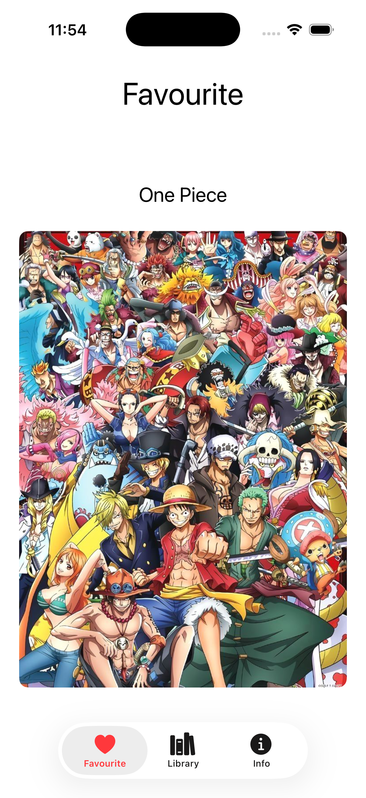
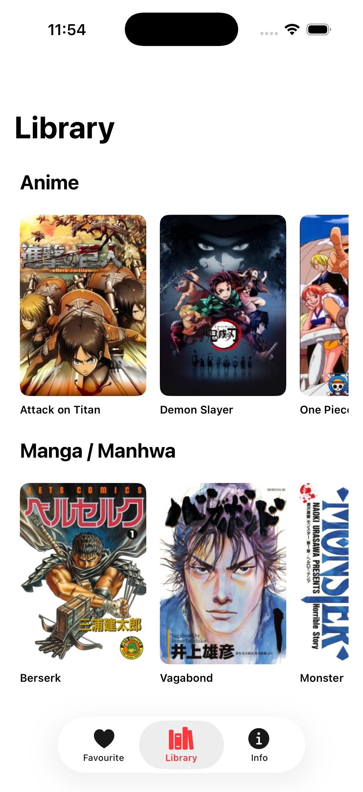
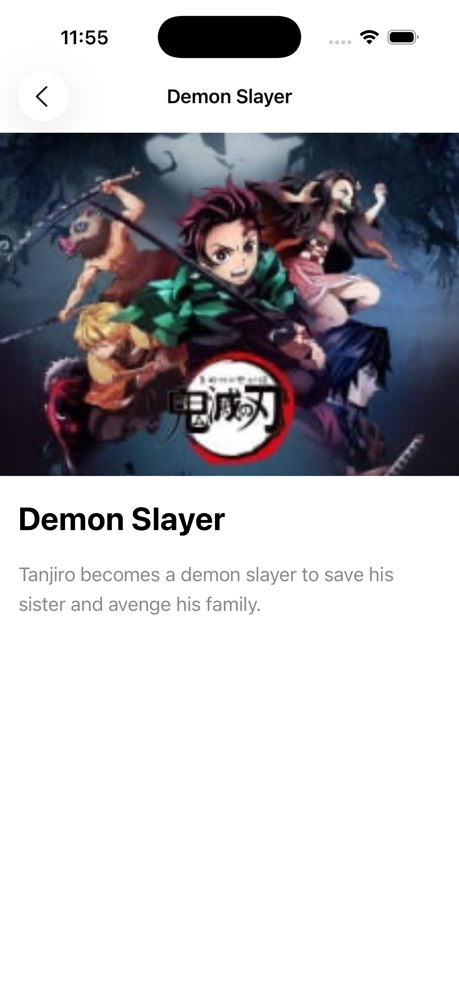
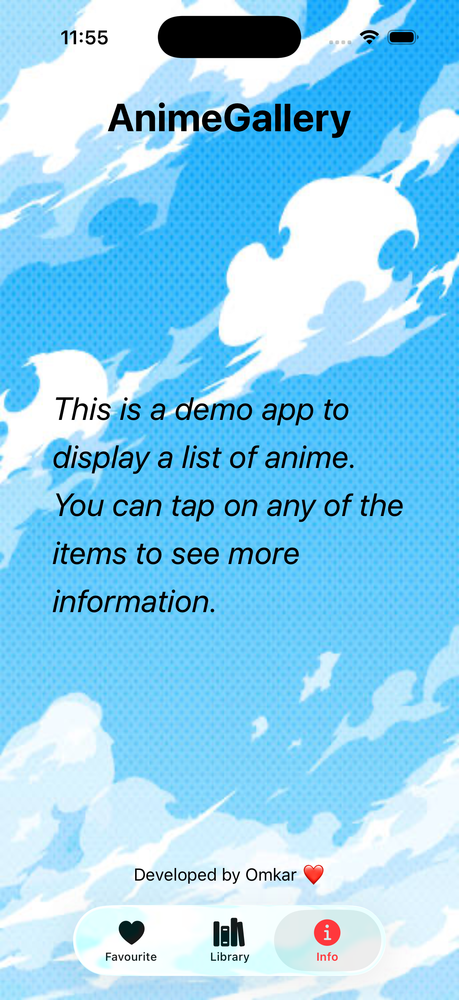
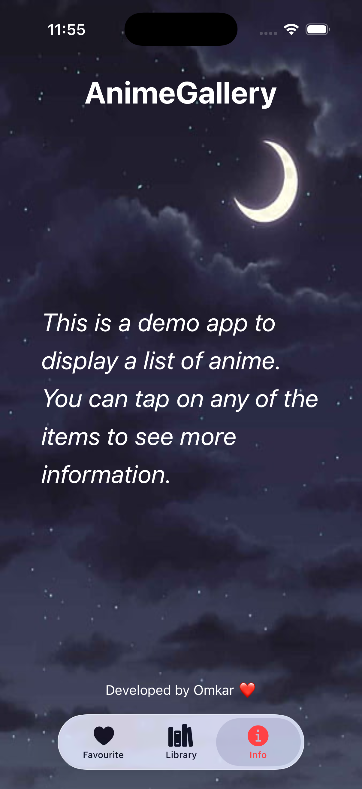

# Swift-Anime-Gallery-App
# 🎌 AnimeVerse - SwiftUI App

AnimeVerse is a simple and elegant **iOS app built with SwiftUI (MVVM)**.  
It showcases anime data, including titles, descriptions, and images — all presented in a clean, modern interface.

---

## 🚀 Features

- 🧩 **MVVM Architecture** – clean separation of logic and views  
- 📱 **SwiftUI Interface** – responsive and lightweight  
- 🧭 **Tab Navigation** – switch easily between sections  
- 🔍 **Anime Detail View** – tap on an anime to view its description and image  
- 💾 **Reusable Model & Constants** – scalable for more data  

---

## 🧠 Tech Stack

| Layer | Technology |
|-------|-------------|
| Frontend | SwiftUI |
| Architecture | MVVM |
| Language | Swift |
| Platform | iOS 17+ |
| IDE | Xcode |

---
## 🖼️ Screenshots
<p align="center">
    
    
    
    
    
</p>

---

## ⚙️ Setup Instructions

1. Clone the repository  
   ```bash
   git clone https://github.com/<your-username>/AnimeVerse.git
   ```
2. Open the project in Xcode
    ``` cd AnimeVerse ```
    open AnimeVerse.xcodeproj
   
4. Build and run the app 🚀


